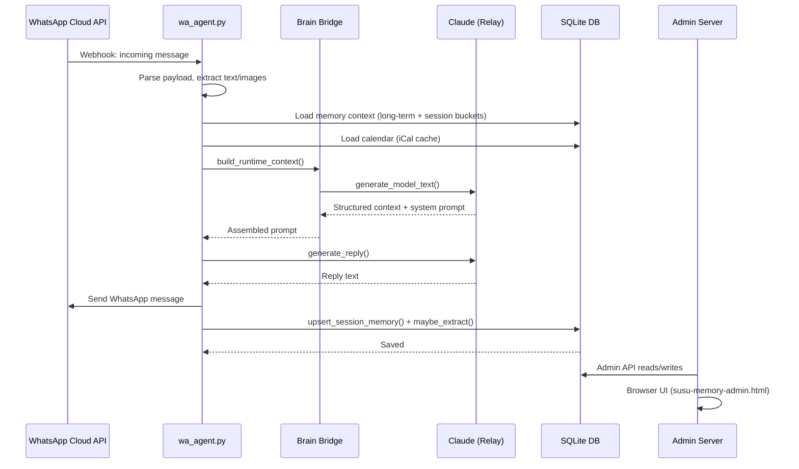

# Architecture

## System Overview

Susu Cloud follows a **Brain Bridge** architecture — a relay-backed, decoupled design where the WhatsApp agent communicates with AI models through a relay API rather than directly with a single provider.

## Data Flow



## Component Breakdown

### wa_agent.py (Monolith Entry)

~7200 lines. Handles:
- HTTP webhook server (port 9100)
- Message parsing and context assembly
- Reply worker subprocess management
- Proactive messaging loop
- Reminder detection and delivery
- Voice message processing (download → transcribe → reply)

**Planned refactor:** Split into `src/wa_agent/` modules (see [REFACTOR-PLAN.md](https://github.com/SimonD0711/susu-cloud-ai-companion-on-whatsapp/blob/main/REFACTOR-PLAN.md)).

### Brain Bridge

The brain bridge assembles the runtime context passed to the LLM:

1. **Memory Context** — long-term memories + session memories from all active buckets
2. **Calendar Context** — today's schedule from iCal cache, HK public holidays, CityU semester state
3. **Location Context** — user's last known location, holiday status
4. **Recent Messages** — last N messages in the conversation
5. **Date Injection** — today's date in ISO format (IMPORTANT prefix) to prevent date blindness

### AI Layer (src/ai/)

```
src/ai/
├── config.py        # AIConfig dataclass — single source of truth for all AI env vars
├── base.py          # Abstract LLMProvider base class
├── llm/
│   ├── manager.py   # LLMManager with fallback logic
│   └── relay.py     # RelayProvider (Claude via relay API)
├── tts/
│   └── minimax.py   # MiniMax TTS wrapper
├── whisper/
│   └── groq.py     # Groq Whisper transcription
└── search/
    ├── router.py     # LLM-driven search routing
    ├── weather.py    # HK Observatory + OpenWeatherMap
    ├── news.py       # Tavily, Google News, Bing, Reddit, X
    ├── music.py      # iTunes, Spotify, YouTube
    └── web.py        # Tavily, Bing, DuckDuckGo, Reddit
```

### Memory Cascade (Bucket System)

```
Message → LLM Extraction / Heuristic Fallback
    │
    ├── within_24h  (TTL: 168h / 7 days, priority: highest)
    ├── within_3d   (TTL: 168h / 7 days)
    ├── within_7d   (TTL: 168h / 7 days)
    ├── archive     (TTL: 7 days after expiry)
    └── long_term   (permanent, importance-rated)
```

**Bucket Classification Logic:**
- Time markers in message text (昨天/今日/尋晚/聽日, etc.) map to appropriate buckets
- `infer_observed_at_from_text()` infers the actual event time from temporal markers
- LLM extraction prompt receives existing memories for deduplication

**Feedback Loop:**
- `use_count` tracks how many times each session memory is referenced
- Memories referenced ≥5 times get 2× TTL extension

### Admin Web UI

Single-page application (no framework) served by `susu_admin_server.py` on port 9001:

- **Long-term Memory** tab — permanent profile knowledge
- **Session Memory** tab — 24h / 3d / 7d buckets with auto-expiry
- **Archive** tab — expired session memories (promoted to long-term)
- **Reminders** tab — scheduled reminders with fire/snooze
- **Settings** tab — system persona, proactive parameters, calendar URL

## Database Schema

SQLite database: `wa_agent.db`

### Key Tables

```sql
-- Long-term profile memories
CREATE TABLE wa_memories (
    id INTEGER PRIMARY KEY,
    wa_id TEXT,
    content TEXT,
    memory_key TEXT,
    created_at TEXT,
    importance INTEGER DEFAULT 3
);

-- Session memories (24h/3d/7d buckets)
CREATE TABLE wa_session_memories (
    id INTEGER PRIMARY KEY,
    wa_id TEXT,
    content TEXT,
    memory_key TEXT,
    bucket TEXT,        -- within_24h, within_3d, within_7d
    observed_at TEXT,   -- when the event actually occurred
    updated_at TEXT,
    expires_at TEXT,
    memory_type TEXT DEFAULT 'event',
    use_count INTEGER DEFAULT 0  -- feedback loop counter
);

-- Message history
CREATE TABLE wa_messages (
    id INTEGER PRIMARY KEY,
    wa_id TEXT,
    direction TEXT,     -- inbound / outbound
    message_id TEXT,
    message_type TEXT,  -- text / image / voice / etc.
    body TEXT,
    quoted_message_id TEXT,
    quoted_preview TEXT,
    created_at TEXT
);

-- Reminders
CREATE TABLE wa_reminders (
    id INTEGER PRIMARY KEY,
    wa_id TEXT,
    content TEXT,
    remind_at TEXT,
    fired INTEGER DEFAULT 0
);

-- Runtime settings (persona, proactive params)
CREATE TABLE wa_susu_settings (
    key TEXT PRIMARY KEY,
    value TEXT
);
```

## Proactive Messaging Engine

Located in `src/wa_agent/proactive.py` (~770 lines), the proactive engine:

1. **Scans** every `WA_PROACTIVE_SCAN_SECONDS` (default 300s)
2. **Checks silence** — must exceed `WA_PROACTIVE_MIN_SILENCE_MINUTES` (default 45)
3. **Loads memory** — prioritizes 24h memories as conversation hooks
4. **Formats proactive prompt** — time-of-day style profile, memory hooks
5. **Generates message** via LLM
6. **Enforces cooldown** — `WA_PROACTIVE_COOLDOWN_MINUTES` (default 180) between sends
7. **Rate limits** — max `WA_PROACTIVE_MAX_PER_SERVICE_DAY` (default 2) proactive messages

## See Also

- [REFACTOR-PLAN.md](https://github.com/SimonD0711/susu-cloud-ai-companion-on-whatsapp/blob/main/REFACTOR-PLAN.md) — Architecture refactor plan
- [OPERATIONS.md](https://github.com/SimonD0711/susu-cloud-ai-companion-on-whatsapp/blob/main/OPERATIONS.md) — Operations manual (production details)
